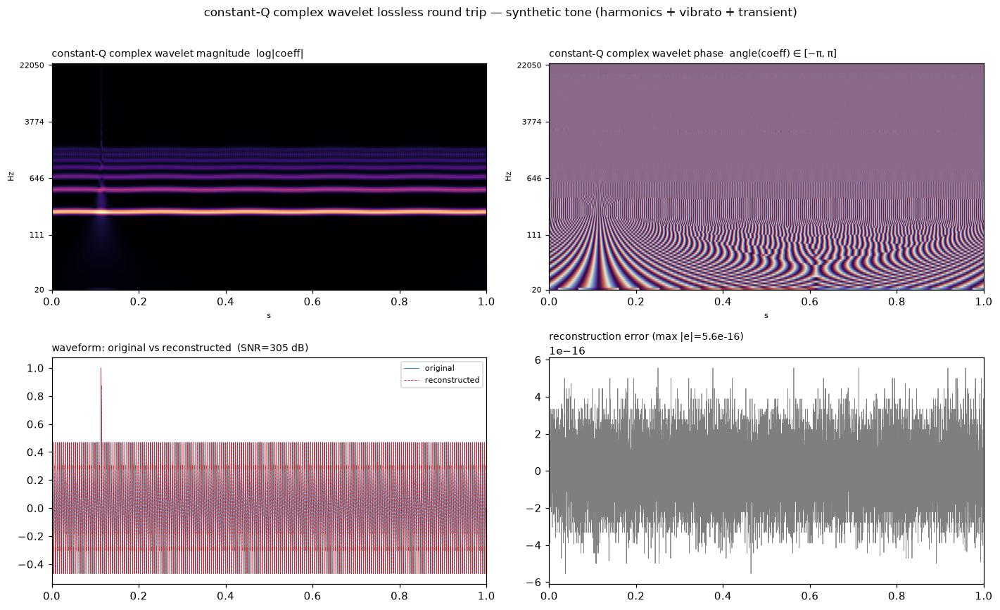
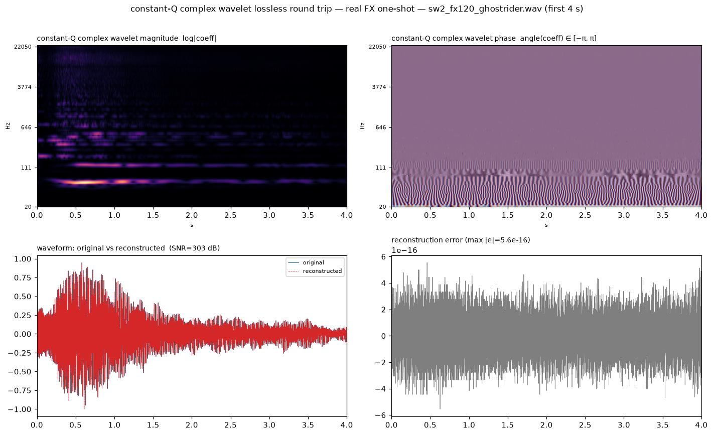
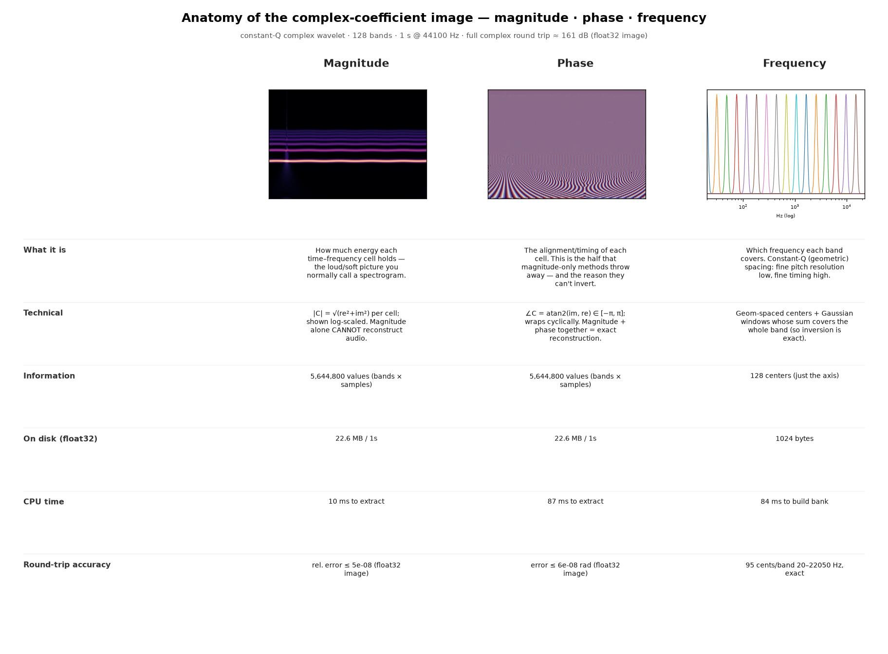

# wavelet2vec

**Deterministic, phase-aware musical embeddings for short audio snippets.**

`wavelet2vec` turns an audio snippet (a drum hit, a synth stab, a texture, a one-shot)
into a fixed-size vector that captures how it *sounds* — timbre, texture, transients,
pitch content, and **waveshape** — with no training, no GPU, and no model download.
Cosine similarity between vectors behaves like perceptual similarity between sounds.

```python
from wavelet2vec import Wavelet2Vec, cosine_similarity

embedder = Wavelet2Vec()
a = embedder.embed_file("kicks/kick_01.wav")
b = embedder.embed_file("kicks/kick_02.wav")
print(cosine_similarity(a, b))  # 0.99 for two similar kicks
```

## Why another audio embedding?

Most audio representations — mel spectrograms, MFCCs, CQT, even the inputs to most
neural audio models — are built on **magnitude** spectra and throw the phase away.
But phase is where half the sound lives: attack sharpness, punch, and waveshape.
A saw wave and a phase-scrambled copy of it have *identical* magnitude spectra and
sound different — and every magnitude-based representation thinks they are the
same sound.

The naive fix, storing raw waveform samples or raw phase, fails for the opposite
reason: phase rotates with every sample of time offset, so two identical snippets
starting 1 ms apart look completely different.

`wavelet2vec` resolves this with **shift-invariant phase features** — quantities
derived from phase that are mathematically immune to time shifts (see below) —
on top of a constant-Q complex Morlet wavelet analysis.

## The key idea: the harmonic phase signature

For a pitched sound with fundamental frequency *f₀*, consider the phase of
harmonic *k* relative to the fundamental:

```
sig(k) = φ(k·f₀) − k · φ(f₀)
```

A time shift of τ rotates the phase of harmonic *k* by −2π·k·f₀·τ — and rotates
*k* copies of the fundamental's phase by exactly the same amount. The combination
**cancels perfectly**: `sig(k)` does not move when the sound moves in time.

What's left is the relative-phase profile of one waveform period — literally the
**waveshape** of the sound. Measured on a saw tone vs. its phase-scrambled twin
(identical magnitude spectra):

| embedding section | similarity |
| --- | --- |
| spectral (wavelet magnitudes) | 0.998 |
| modulation (texture) | 0.981 |
| transient (envelope) | 1.000 |
| harmonic (chroma/pitch) | 1.000 |
| **phase (this work)** | **0.860** |

Only the phase section hears the difference — while a 3.7 ms time shift of the
same sound still yields > 0.98 overall similarity.

Two more shift-invariant phase quantities round out the section:

- **Instantaneous frequency** (the time derivative of band phase) — separates
  steady tones from vibrato from noise inside each band.
- **Cross-band onset phase coherence** — at a genuine transient, all wavelet
  bands phase-lock for an instant; a loudness bump without phase alignment is
  not a real attack.

## Embedding layout (570 dims by default)

| Section | Dims | Source | Captures |
| --- | --- | --- | --- |
| `spectral` | 128 | constant-Q complex Morlet scalogram: per-band mean + std of log energy | spectral color, brightness, body |
| `modulation` | 64 | second-order modulation spectrum of band envelopes (scattering-style) | texture: roughness, tremolo, grain |
| `transient` | 40 | Hilbert envelope morphology + scalogram onset flux | envelope shape, log attack time, decay, crest, onset density |
| `harmonic` | 15 | chroma, autocorrelation pitch, spectral flatness | notes/chords, tonal vs. noisy, pitch height |
| `phase` | 40 | shift-invariant phase statistics | vibrato/noisiness, true attacks, **waveshape** |
| `stereo` | 27 | mid/side and inter-channel analysis per band group | width, decorrelation, pan balance — frequency-dependent stereo image |
| `conv` | 256 | wavelet-initialized 1D conv encoder | local band-envelope dynamics; trainable upgrade path |

Stereo files are analyzed both as a mono mixdown (all timbral sections) and
as a left/right pair (the `stereo` section: side/mid width, inter-channel
coherence, and balance, globally and per frequency group — all invariant to
level and common time shifts). Mono files get the canonical "perfectly
centered" stereo vector, so every embedding has the same dimensions.

Each section is L2-normalized and weighted before concatenation, so cosine
similarity acts as a weighted blend of per-aspect similarities. Weights are
configurable — set `harmonic` to 0 to compare timbre while ignoring pitch, or
`include_conv=False` to drop the convolutional branch.

Embeddings are invariant to input **sample rate**, **playback level**, and
**small time shifts**, and they are exactly reproducible across runs.

## Installation

```bash
pip install git+https://github.com/<your-username>/wavelet2vec.git
# or, from a clone:
pip install -e ".[dev]"
```

Dependencies: `numpy`, `scipy`, `soundfile`, `torch` (CPU is fine).

## Usage

### Python

```python
import numpy as np
from wavelet2vec import Wavelet2Vec, Wavelet2VecConfig, cosine_similarity

embedder = Wavelet2Vec()

# From a file (any sample rate, mono or stereo, WAV/FLAC/AIFF/OGG)
vec = embedder.embed_file("snippets/snare_07.wav")

# From an array: [channels, samples] or 1D mono
vec = embedder.embed(np.random.randn(1, 22050).astype(np.float32), 22050)

# Whole library at once
library = embedder.embed_folder("snippets/")          # dict[str, np.ndarray]

# Inspect individual aspects (raw, unnormalized features)
parts = embedder.embed_components(waveform, 44100)
print(parts["phase"], parts["transient"])

# Custom weighting: timbre-only comparison
config = Wavelet2VecConfig(section_weights={
    "spectral": 1.0, "modulation": 1.0, "transient": 1.0,
    "harmonic": 0.0, "phase": 0.5, "conv": 0.5,
})
timbre_embedder = Wavelet2Vec(config)
```

### Command line

```bash
# Embed a folder, save vectors and a similarity matrix
wavelet2vec embed --input snippets/ --output embeddings.npz --pairwise similarity.csv

# Find the 5 sounds most similar to a reference
wavelet2vec embed --input snippets/ --query reference.wav --top-k 5

# Make a sound 40% more similar to another sound
wavelet2vec transfer --source pad.wav --target pluck.wav --amount 0.4 --output morphed.wav

# Create a new sound from several references with chosen amounts
wavelet2vec blend --inputs pluck.wav piano.wav vocal.wav --weights 0.5 0.3 0.2 --output new.wav
```

## Style transfer and blending

The embedding's analysis doubles as a synthesis guide. `style_transfer` makes
a source sound more similar to a target by a given amount; `blend` creates a
new sound that is similar to *several* references by chosen amounts — e.g. a
synth pluck, a piano note, and a vocal snippet:

```python
from wavelet2vec import Wavelet2Vec, blend, cosine_similarity
from wavelet2vec.audio_io import load_audio, save_audio

refs = [load_audio(p) for p in ("pluck.wav", "piano.wav", "vocal.wav")]
new, sr = blend(
    [w for w, _ in refs], [r for _, r in refs],
    weights=[0.5, 0.3, 0.2],   # how much of each reference
)
save_audio("new_sound.wav", new, sr)
```

One reference (the **carrier**, by default the heaviest-weighted one)
provides the fine structure — pitch, waveshape, micro-detail — and is then
reshaped toward the weighted blend of all references in two dimensions:

- **spectral envelope**: wavelet band energies are EQ-matched to the weighted
  geometric mean of the references' band energy distributions;
- **temporal envelope**: the amplitude envelope is morphed toward the weighted
  average of the references' time-normalized envelope shapes.

The result is verified by the embedding itself. For the pluck/piano/vocal
example above (weights 0.5/0.3/0.2), the new sound is *closer to every
reference than the references are to each other*, ordered by weight:

| pair | similarity |
| --- | --- |
| new ↔ pluck | 0.95 |
| new ↔ piano | 0.81 |
| new ↔ vocal | 0.79 |
| pluck ↔ piano (for comparison) | 0.78 |
| pluck ↔ vocal (for comparison) | 0.67 |

`style_transfer(source, source_sr, target, target_sr, amount)` is the
two-sound special case: `amount=0` returns the source unchanged, `amount=1`
fully matches the target's spectral and temporal envelopes, and the embedding
similarity to the target increases monotonically with `amount` (tested).

## Group character

A character can come from a whole *group* of sounds, not just one file —
e.g. "make this vocal crunchy like my electric guitar library, without just
slapping distortion on it." The group's average character (geometric mean of
band energy distributions, mean envelope shape) is extracted once, can be
saved to a file, and applied to anything:

```python
from wavelet2vec import character_from_folder, apply_character

guitars = character_from_folder("samples/electric_guitars/")
guitars.save("guitar_character.npz")

crunchy_vocal = apply_character(vocal, 44100, guitars, amount=0.6)
```

```bash
wavelet2vec character --inputs samples/electric_guitars/ --output guitar.npz
wavelet2vec transfer --source vocal.wav --target guitar.npz --amount 0.6 --output crunchy.wav
```

The morph EQ-matches the group's harmonic density and reshapes the envelope
while keeping the vocal's pitch, vibrato, and waveshape — character transfer,
not a distortion effect. (True nonlinear excitation is intentionally out of
scope; this transfers where the energy *sits*, not how it clips.)

## ADSR control — for volume and for character

`ADSR(attack, decay, sustain, release)` can shape a snippet's loudness, or —
the more interesting use — **how much of a character it takes on over time**.
A slow attack means the sound starts as itself and grows into the character:

```python
from wavelet2vec import ADSR, apply_adsr_character, apply_adsr_volume

# vocal that gradually becomes synth-like over 0.6 s, then falls back
morph_env = ADSR(attack=0.6, decay=0.1, sustain=1.0, release=0.3)
result = apply_adsr_character(vocal, 44100, synth_character, morph_env)

# plain volume shaping
result = apply_adsr_volume(result, 44100, ADSR(0.01, 0.1, 0.8, 0.2))
```

This is artifact-free by construction: the morph preserves the source's
phase, so the time-varying crossfade between source and morph interpolates
the character smoothly (no comb filtering).

## Sequencing with FL Studio automation

`render_sequence` plays snippets in order while an automation clip develops
the texture across the sequence. The clip can come from FL Studio (`.flp` /
`.fst`, via the optional `pyflp` package) or a simple CSV/JSON export, and it
modulates one parameter of the character morph per snippet — the amount, or
the ADSR attack/decay/sustain/release:

```python
from wavelet2vec import ADSR, AutomationCurve, character_from_folder, render_sequence

synth = character_from_folder("samples/synth_plucks/")
rise = AutomationCurve.from_file("automation.flp")   # or .csv / .json

result, sr = render_sequence(
    [vocal] * 8, [44100] * 8,
    character=synth,
    character_adsr=ADSR(attack=0.4, decay=0.1, sustain=1.0, release=0.15),
    automation=rise,
    modulate="attack",   # each next snippet grows into the synth faster
)
```

```bash
wavelet2vec sequence --inputs vowel1.wav vowel2.wav vowel3.wav vowel4.wav \
  --character synth_plucks/ --adsr 0.4 0.1 1.0 0.15 \
  --automation automation.flp --modulate attack --output developed.wav
```

With a rising clip and `--modulate amount`, the development is measurable in
embedding space: a four-snippet vocal sequence against a guitar-group
character moves 0.674 → 0.684 → 0.696 → 0.709 in similarity to the guitars,
snippet by snippet (tested).

## DAW round-trip: `perform`

For material that lives in the DAW rather than in one-shot files: render the
pattern as one long stem (e.g. 16 bars of repeated 8th notes), and `perform`
slices it into notes, morphs each note with the automation-driven character
development, and reassembles at the **exact original length** — the result
drops back into the playlist at bar 1, sample-aligned, like an offline effect:

```bash
wavelet2vec perform --input stem.wav --character guitars/ \
  --automation project.flp --slice grid --bpm 140 --division 8 \
  --adsr 0.4 0.1 1.0 0.15 --modulate attack --output stem_performed.wav
```

Note starts can come from the BPM grid (`--slice grid`, exact for quantized
patterns), embedded WAV cue markers from Sound Forge / Edison / FL slicing
(`--slice cues`), a marker file (`--slice markers`), or onset detection
(`--slice onsets`). The full workflow guide is in
[docs/WORKFLOW.md](docs/WORKFLOW.md).

## Audio quality

Built for high-resolution work: any input bit depth loads losslessly
(internal math is float64), the morph runs at the file's **native sample
rate** (88.2/96 kHz passes through with no resampling or lowpass in the
signal path), output WAV/AIFF is **32-bit float** by default, and the
character analysis covers the full audible band up to ~19.8 kHz so air and
crunch transfer too. Only the analysis is band-limited — the audio never is.

## What it's good for

- **Similarity search & deduplication** over sample libraries
- **Clustering and browsing** sound collections by perceptual character
- **Sound creation**: blend several references into a new sound, or pull one
  sound toward another by a chosen amount (`blend` / `style_transfer`)
- **Sound design pipelines**: pairing, interpolation targets, reward signals
  for generative models ("does the generated sound sit between A and B?")
- **Analysis**: per-aspect comparison (same pitch? same texture? same width?)

## What it's *not*

This is a signal-level embedding: it knows *how a sound sounds*, not what it is.
It won't encode semantics like "vintage drum machine" — for that, concatenate it
with a pretrained text-audio model such as CLAP. It also summarizes snippets
globally; long-form temporal structure beyond the envelope is not preserved.

## The trainable path

The `conv` section comes from `WaveletConvEncoder`, a two-layer 1D CNN whose
first layer is a strided quadrature (cos/sin) convolution **initialized as a
Morlet wavelet filterbank** — the modulus of each pair gives translation-stable
band envelopes. Frozen by default, so everything stays deterministic; pass
`trainable=True` to fine-tune it (e.g. contrastively on your own library),
starting from a meaningful solution instead of random noise:

```python
from wavelet2vec import WaveletConvEncoder

encoder = WaveletConvEncoder(trainable=True)  # torch nn.Module, [B, 1, N] -> [B, 256]
```

## Experiments & visualization

The [`experiments/`](experiments/) suite (`pip install -e ".[viz]"`) visualizes
every pipeline stage, compares the wavelet front end to mel spectrograms, and
runs a lossless audio↔image round trip — all on your own audio, with metrics
scored against filename/key labels:

```bash
python -m experiments.run_experiments --audio-dir /path/to/audio_library
```

Input may be any bit depth, sample rate, channel count, or length; everything
is normalized once up front (decode to float, resample to a common rate, never
down-sampled) so mel and wavelet see identical signals.

### Lossless / near-perfect audio ↔ image round trip

A magnitude-only spectrogram (mel, CQT magnitude, Griffin-Lim) throws phase
away and **cannot** be inverted. Keep the **full complex coefficients
(magnitude *and* phase)** at full resolution and the transform is exactly
invertible — the image literally is the audio. The suite turns each snippet
into a picture and back:



*Audio in → the magnitude and phase images → audio back out. The original and
reconstruction overlap exactly (305 dB in memory), and the error (bottom-right)
is pure numerical noise at ~5×10⁻¹⁶.*

It holds for real, complex material too — here a dense FX sweep with evolving
broadband texture (from the included example library):



*A 4-second FX sweep with rich, time-varying content reconstructs at 303 dB —
the intricate magnitude and phase images carry it back losslessly.*

Saved as an actual image file, the storage format sets the fidelity:

| storage format | reconstruction SNR | notes |
| --- | --- | --- |
| float64 (`.npy`) | ~300 dB | bit-exact, machine precision |
| **float32 image (`.tiff`)** | **~160 dB** | **base case** — viewable image, beyond 24-bit audio (no audible loss) |
| 16-bit image (`.png`) | ~84 dB | near-transparent, most compact |
| 8-bit image (`.png`) | ~14 dB | destroyed — ordinary 8-bit is *not* enough |

The base case is a **float32 TIFF**: each `roundtrip/perfect_tiff/<folder>_coefficients_float32.tiff`
plus a tiny JSON sidecar (scale + wavelet parameters) is self-contained — it
reconstructs the audio on its own (`<folder>_from_image.wav`) at ~160 dB,
near-perfect for any playback chain. For literal bit-exactness, `.npy` keeps
float64.

#### What the image is made of: magnitude · phase · frequency



Each coefficient carries a **magnitude** and a **phase**, laid out on a
**frequency** axis of constant-Q wavelet bands. Measured on a 1 s / 44.1 kHz
tone at 128 bands:

| | Magnitude | Phase | Frequency |
| --- | --- | --- | --- |
| **What it is** | energy per time–frequency cell (the usual spectrogram) | alignment/timing of each cell — the half magnitude-only methods discard | which frequency each band covers (constant-Q, geometric) |
| **Technical** | `|C| = √(re²+im²)`, log-scaled | `∠C = atan2(im, re) ∈ [−π, π]`, cyclic | geom-spaced centers + Gaussian windows that sum to full coverage |
| **Information** | 5.64 M values (bands × samples) | 5.64 M values | 128 centers (just the axis) |
| **On disk (float32)** | 22.6 MB / s | 22.6 MB / s | ~1 KB |
| **CPU time** | ~10 ms to extract | ~87 ms to extract | ~83 ms to build the filterbank |
| **Round-trip accuracy** | rel. error ≤ 5×10⁻⁸ | error ≤ 6×10⁻⁸ rad | 95 cents/band, 20 Hz–22 kHz, exact |

Magnitude alone cannot reconstruct audio; **magnitude + phase together are
exact**. The frequency axis is just metadata (a few hundred bytes). The
forward transform is ~170 ms and the inverse ~60 ms per second of audio (CPU,
float64). Regenerate these figures with
`python -m experiments.make_docs_figures`.

### What we learned

- **Phase is half the sound.** A saw wave and its phase-scrambled twin have
  *identical* magnitude spectra; only the phase differs. The `phase_matters`
  figure shows full-complex reconstruction (perfect) vs. magnitude-only
  (a smooth, destroyed blob). This is why wavelet2vec keeps phase — and why its
  embedding has a dedicated, shift-invariant `phase` section.
- **For lossless conversion, raise *value* resolution, not *image* resolution.**
  The transform is mathematically exact at *any* number of frequency bands —
  64, 128, or 256 bands all reconstruct at ~300 dB. Making the picture bigger
  (more time/frequency cells) buys nothing; the only thing that limits a stored
  round trip is the bit depth per coefficient. So "near-perfect" comes from
  float pixels, not from a higher-resolution grid.
- **The wavelet front end beats mel on musical structure.** On a 356-file
  reference library, wavelet2vec reaches **0.60 k-NN folder purity vs 0.41** for
  a mel-summary baseline (random ≈ 0.09), with positive vs. negative
  silhouette — it groups sounds by content type far more cleanly. Its harmonic
  section also recovers pitch class better than mel chroma overall (**0.54 vs
  0.50**, and **0.90 vs 0.80 on bass**), scored against the notes in the
  filenames.
- **Constant-Q matches both hearing and music.** Log-spaced wavelet bands give
  fine time resolution where transients live (highs) and fine frequency
  resolution where pitch lives (lows) — visible side-by-side against the linear
  mel grid in the comparison gallery.

Full write-up, figures, and how to reproduce: [experiments/EXPERIMENTS.md](experiments/EXPERIMENTS.md).

## How it works

See [docs/DESIGN.md](docs/DESIGN.md) for the full theory: the shift-variance
problem, the constant-Q Morlet filterbank, second-order (scattering-style)
modulation features, the math behind the phase invariants, and the wavelet
initialization of the conv encoder.

## Development

```bash
pip install -e ".[dev]"
pytest
```

The test suite covers determinism, shift/level/sample-rate invariance, pitch
class detection, attack discrimination, and the saw vs. phase-scrambled-saw
waveshape separation.

## License

MIT
